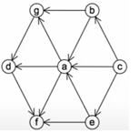
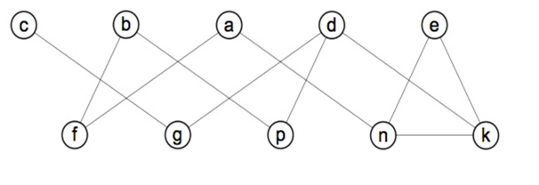
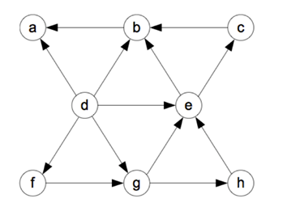
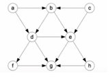
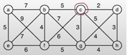

1. Consider the directed graph that is represented by the adjacency matrix below
```
    a   b   c   d   e
a   0   1   0   0   0
b   0   0   1   1   0
c   1   0   0   0   0
d   0   0   0   0   1
e   0   0   1   0   0
```

How many cycles sxist in this graph?
Answer: 2

2. Consider the directed graph that is represented by the adjacency list below
```
{
    {a: {f}}
    {b: {c}}
    {c: {b}}
    {d: {e}}
    {e: {d}}
    {f: {a}}
}
```

How many edges exists in this graph?
Answer: 6

3. Consider the graph. Starting at vertex `e` and resolving ties by the vertex alphaabetical order. Tranverse the graph by breadth-first-search (bfs)

List the order of vericies based on BFS

Requirement: Give your answer as a single lowercase string of vertex labels without any space. for example abcdefgh

Note #1 no marks given if your answer is in different format

Note #2: No partial marks will be given



Answer: eafdgbc


4. Consider the graph. Starting at vertex `e` and resolving ties by the vertex alphaabetical order. Tranverse the graph by breadth-first-search (bfs)

List the order in which the vertices were reaches for teh first time.

Requirement: Give your answer as single lowercase string of vertex labels, with not spaces. For example: abc..



Answer: ekdgcpbfan

5. Apply the dfs based topological sort algorithm to the above graph. Start at vertex d. Resolve ties in lexicographic order.

Give the order that the vertices become dead-ends (ie the reverse topo sort order)

Requirement: State your answer as a string or vertices ex abc..


Answer: abcehgfd

6. Apply the dfs based topological sort algorithm to the above graph. Start at vertex a. Resolve ties in lexicographic order.

Give the order that the vertices become dead-ends (ie the reverse topo sort order)

Requirement: State your answer as a string or vertices ex abc..



Answer: ghefdbac

7. Apply prims algorithm to the graph shown below. STart at vertex C. and resolve ties by choosing hte vertex that come sfirst in lexicographic order.

Give the order that the vertices are added to the solution MST.
Requirement: Your answer should be a string of vertex labels, with no white space or extraneous characters (for example: abc..)

Note #1: No marks given if your answer is in different format

Note #2 No partial marks will be given.



8. Apply prims algorithm to the graph shown below. Start at vertex d, and resolve ties by choosing the vertex that comes first in lexicographic order. 

Give the order that the certices are added to teh solution MST

Requirement: your answer should be a string of vertex labels with no white space or extraceous characters. Ex abc


