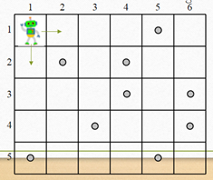
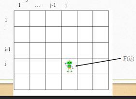

# Class 11

Dynamic Programming (Chapter 8)
- Fibonacci numbers
-- Robot Coin Collecting
-- Backtracking (Chapter 12) 
- n Queen problem
-- Branch and Bound (Chapter 12)
- Assignment problem

## Dynamic Programming
- Dynamic Programming is a general algorithm design technique for solving  optimization problems
- Invented by American mathematician Richard Bellman in the 1950s
- “Programming” here means “planning”

## Fibonacci Number
Fibonacci numbers:
0, 1, 1, 2, 3, 5, 8, 13, 21, 34, ... 
where each number is the sum of  the preceding two.
fib(0) = 0
fib(1) = 1
fib(n) = fib(n-1) + fib(n-2)

```
fib (n) {
    if  n < 2
        f  = n;
    else
        f=fib(n-1) + fib(n-2) 
    return f
}
```

F(n) takes exponential time to compute.  

- we want to have it in an array to check the previous places we checked

## Dynamic Programming (top- down)
```
fib (n) {
    If  n is in memo, return  memo[n];
    if  n < 2
        f = n;
    else
        f=fib(n-1) + fib(n-2)
    memo[n] = f; 
    return f
}
```

Efficiency:
- time: O(n)
- space: Needs an extra array

## Dynamic Programming (Bottom -up)
```
fib (n) {
    memo[0]= 0;
    memo[1]= 1;
    for i← 0 to n do
        memo [i] = memo[i-1] + memo[i-2]
    return memo[n]
}
```

Efficiency:
- time: O(n)
- space: Needs an extra array

How can we make the array be persistant?
- when you define something in the function when the function is done the array is gone
- make sure the array is in the class but not in the function - should be static
- when the function is done if you define the array in there then your array is not persistant

## Dynamic programming
- Exactly the same as divide-and-conquer ...
but store the solutions to sub-problems for possible reuse.
- A good idea if  many of  the sub-problems are the same as one another.

## Robot Coin-collecting 
Several coins are placed in cells of  an `n×m` board.  A robot, located in the upper left cell of  the  board, needs to collect as many of  the coins as possible and bring them to the bottom right cell.  On each step, the robot can move either one cell to the right or one cell down from its  current location.



### Solution



Let F(i,j) be the largest number of  coins the robot can collect and bring to cell (i,j) in the ith row and jth column

The largest number of  coins that can be brought to cell (i,j)
from the left neighbor ?  F(i, j-1)
from the neighbor above? F(i-1,j)

The recurrence: 
F(i, j) = max{F(i-1, j),  F(i, j-1)} + cij for 1 ≤  i ≤ n, 1 ≤ j ≤ m
where cij = 1 if  there is a coin in cell (i,j), and cij = 0 otherwise

F(i, j ) = max{F(i-1, j ),  F(i, j-1)} + cij
F(0, j ) = 0 for 1 ≤ j ≤ m  and F(i, 0) = 0 for 1 ≤ i ≤ n.

F(i, j) = max{F(i-1, j),  F(i, j-1)} + cij for 1 ≤  i ≤ n, 1 ≤ j ≤ m

## Robot Coin Collection
```
ALGO RobotCoinCollection(C[1..2,1..m])
    // Robot coin collection using dyanmic programming
    // input: Matrix C[1..n,1..m] with elements equal to 1 and 0 for cells with and without coins, respectively
    // output: Returns the maximum collectible number of coins
    F[1,1] <- C[1,1]
    for j <- 2 to m do
        F[1,j] <- F[1, j-1] + C[1+j]
    for i <- 2 to n do
        F[i-1] <- F[i-1,1] + C[i,1]
        for j <-2 to m do
            F[i,j] <- max(F[i-1,j], F[i,j-1]) + C[i,j]
    return F[n,m]

```

Complexity? O(nm) time, O(nm) space

## Dynamic Programing: General Principles
Step 1:
- Decompose problem into simpler sub-problems
Step 2: 
- Express solution in terms of  sub-problems
Step 3: 
- Use table to compute optimal value bottom-up
Step 4:
- Find optimal solution based on steps 1-3

## Backtracking - not part of dynamic programming
- Suppose you have to make a series of  decisions, among various choices, where
-- You don’t have enough information to know what to choose
-- Each decision leads to a new set of  choices
-- Some sequence of  choices (possibly more than one) may be a solution to your problem
- Backtracking is a methodical way of  trying out various sequences of  decisions, until you find one that “works” 

- `you are allowed to go back to change your idea`

Think of  the solutions as being organized in a tree
- The root represents initial state before the search begins
- Nodes at first level represent first choice
- Second... second choice..etc

```
            ROOT
          /     \
        A        B
       / \      / \
      C   D    E   F
     BAD BAD GOOD BAD
```

## Backtracking in words
IDEA:
- Construct solutions one component at a time
- If  a partial solution can be developed further without violating constraints:
-- Choose first legitimate option for the next component
- If  there is no option for the next component
-- Backtrack to replace the last component of  partial solution

## Backtracking – Abstract Example
- Starting at Root, your options are A and B. You choose A.
- At A, your options are C and D. You choose C.
- C is bad. Go back to A.
- At A, you have already tried C, and it failed. Try D.
- D is bad. Go back to A.
- At A, you have no options left to try. Go back to Root.
- At Root, you have already tried A. Try B.
- At B, your options are E and F. Try E.
- E is good. Congratulations!

## Backtracking 
- the tree used to build solutions is  called the `state-space tree`
- The nodes are `partial solutions`
- The edges are `choice`

## Backtracking n-Queens Problem
- Place n queens on an n-by-n chess board so that no pair of  them are in the same row, column or diagonal
- Basically, no queen can attack any other queen.

## Example: 4-Queens pg 25
We can solve it by backtracking
•Root is empty board
•At level i... put a queen in row i
n = 4 

## State-Space Tree of  4-Queens
For any n>3, a solution can be found in linear time

## Branch and Bound
The idea:
Set up a `bounding function`, which is used to compute a `bound` (for the value of  the objective function)` at a node` on a state-space tree and determine `if  it is promising`
- `Promising` (if  the bound is better than the value of  the best solution so far): expand 
beyond the node.
- `Non-promising` (if  the bound is no better than the value of  the best solution so far): 
not expand beyond the node (pruning the state-space tree).

- its like its going BFS order vs backtracking is DFS

## Assignment problem
Select one element in each row of  the cost matrix C so that: 
- no two selected elements are in the same column (Can only select a column once)
- the sum is minimized

## Branch & Bound: Assignment Problem
Lower bound (lb): 
- Any solution to this problem will have total cost at least 10
- All children of  this will have a solution higher then lb
- Initialize: Pick the lowest number in each row

Lower bound:
```
    Job 1   Job 2   Job 3   Job 4
a   9      `2`      7       8
b   6       4      `3`      7
c   5       8      `1`      8
d   7       6       9      `4`
```
Start with:
2 + 3 + 1 + 4 = 10 minimum


There might be a question with upper bound so then you do the opposite way.